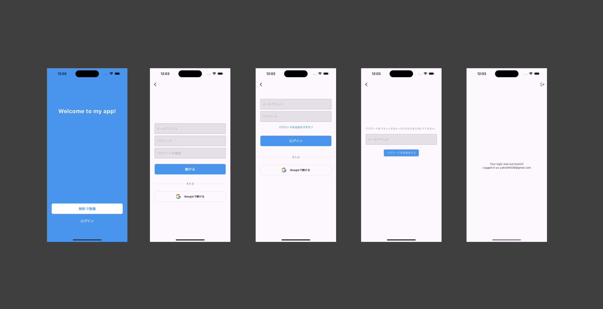

## ui

## steps

1. create a project in firebase
2. run `flutterfire config`.
3. update GIDClientID and CFBundleURLSchemes strings in `ios/Runner/Info.plist` based on `ios/Runner/GoogleService-Info.plist
